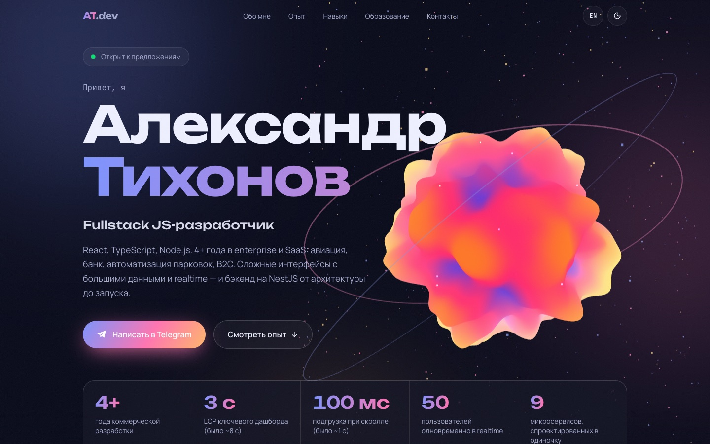
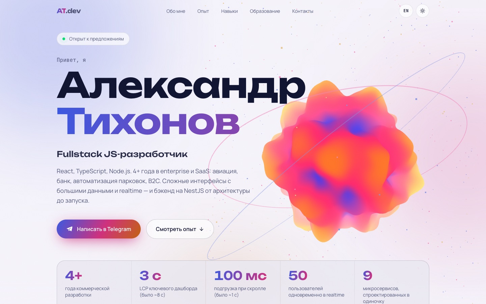

# Aleksandr Tikhonov — Portfolio

[](https://github.com/dclxxxvi/portfolio/actions/workflows/deploy.yml)


Personal portfolio of a Fullstack JS developer: experience, case studies and contacts — in Russian and English.

**Live:** https://dclxxxvi.github.io/portfolio/ · [English version](https://dclxxxvi.github.io/portfolio/en/)

<p>
  
  
</p>

## Highlights

- **Interactive 3D hero** — a custom GLSL shader (simplex-noise displacement, fresnel glow) rendered with React Three Fiber. The scene follows the cursor and scroll, loads only when the browser is idle, pauses off-screen, and is skipped for `prefers-reduced-motion` or when WebGL is unavailable.
- **Case studies** for every role in a “problem → solution → result” format, with an accessible accordion.
- **Motion** — scroll reveals, a scroll-linked timeline, animated counters, cursor spotlight and card tilt.
- **Two languages** with separate static routes (`/` for Russian, `/en/` for English), `hreflang` alternates and per-locale metadata.
- **Dark and light themes** with no flash on load.
- **Content separated from code** — every text lives in typed dictionaries in [`src/content`](src/content); components only render data.
- **Static export** to GitHub Pages; no server required.

## Tech stack

| Area      | Tools                                                                       |
| --------- | --------------------------------------------------------------------------- |
| Framework | Next.js 16 (App Router, static export), React 19                            |
| Language  | TypeScript (strict, `noUncheckedIndexedAccess`)                             |
| Styling   | Tailwind CSS 4, CSS custom properties as design tokens                      |
| Animation | Motion, React Three Fiber, Three.js, custom GLSL                            |
| Quality   | ESLint (Next + typescript-eslint), Prettier, Husky, lint-staged, commitlint |
| CI/CD     | GitHub Actions → GitHub Pages                                               |

## Getting started

Requires Node.js 22+ and pnpm.

```bash
pnpm install
pnpm dev          # http://localhost:3000
```

| Script           | What it does                       |
| ---------------- | ---------------------------------- |
| `pnpm dev`       | Start the dev server               |
| `pnpm build`     | Build the static site into `out/`  |
| `pnpm start`     | Serve `out/` locally               |
| `pnpm lint`      | Run ESLint                         |
| `pnpm typecheck` | Generate route types and run `tsc` |
| `pnpm format`    | Format everything with Prettier    |

## Project structure

```
src/
├── app/
│   ├── (ru)/              # Russian root layout and page — served at /
│   ├── (en)/en/           # English root layout and page — served at /en/
│   ├── globals.css        # Design tokens (dark/light), Tailwind theme, utilities
│   ├── sitemap.ts, robots.ts, icon.svg
├── components/
│   ├── hero/              # WebGL scene, shader, lazy loader
│   ├── layout/            # Header, footer, theme toggle, scroll progress
│   ├── sections/          # Hero, About, Experience, Skills, Education, Contact
│   └── ui/                # Reveal, Section, SpotlightCard, Counter, Tag, icons
├── content/
│   ├── types.ts           # Content model
│   ├── ru.ts, en.ts       # All texts, one dictionary per language
│   └── site.ts            # URLs and contacts
└── lib/                   # Dates, theme store, helpers
docs/                      # Requirements, engineering standards, content drafts
```

### Editing content

Everything shown on the page is in `src/content/ru.ts` and `src/content/en.ts`. Both files implement the same `Dictionary` type, so TypeScript flags any field missing from a translation. Job durations are calculated from `period` at build time, and a monthly scheduled deploy keeps them up to date.

## Deployment

Pushing to `main` runs [`deploy.yml`](.github/workflows/deploy.yml): lint, type check, build and publish to GitHub Pages. The Pages base path and site URL come from `actions/configure-pages`, so the same code works for a project site (`/portfolio/`) and a custom domain.

One-time setup: **Settings → Pages → Source: GitHub Actions**.

## License

The source code is [MIT](LICENSE). Texts, the photo and other personal content are © Aleksandr Tikhonov.
